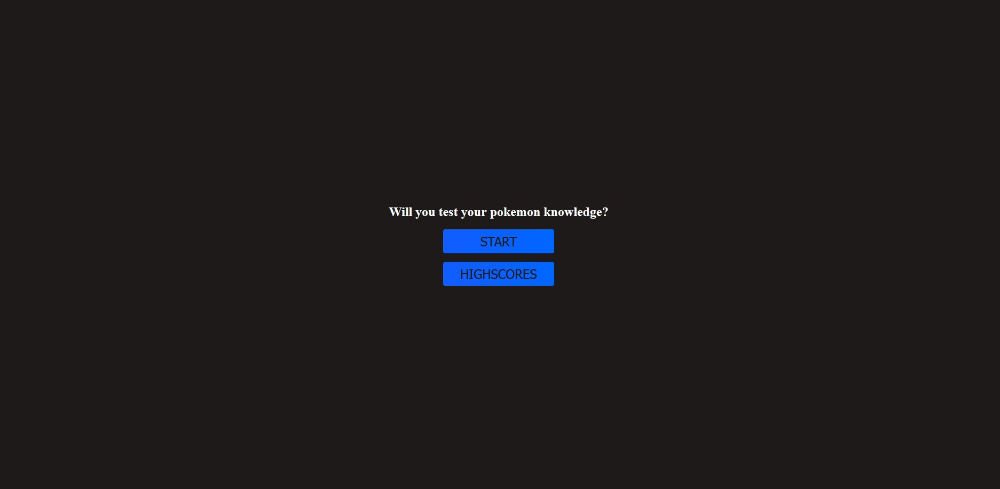
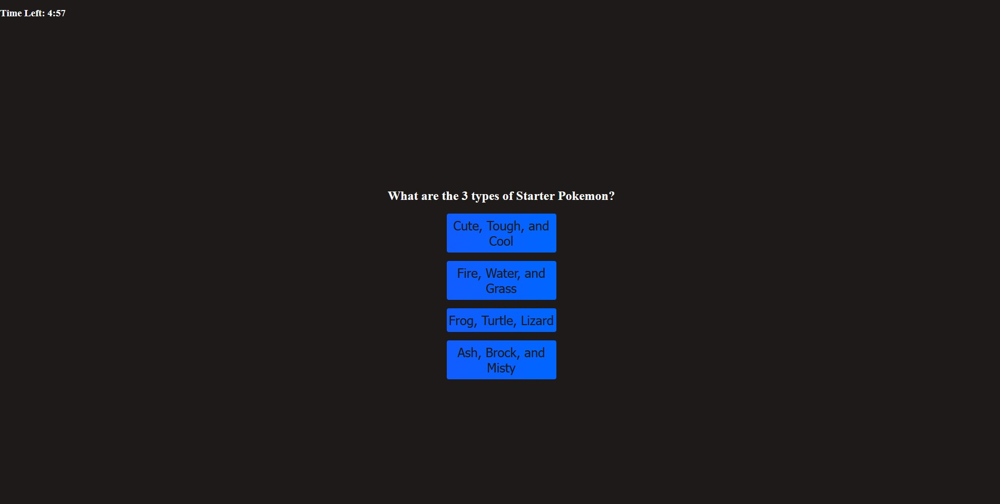
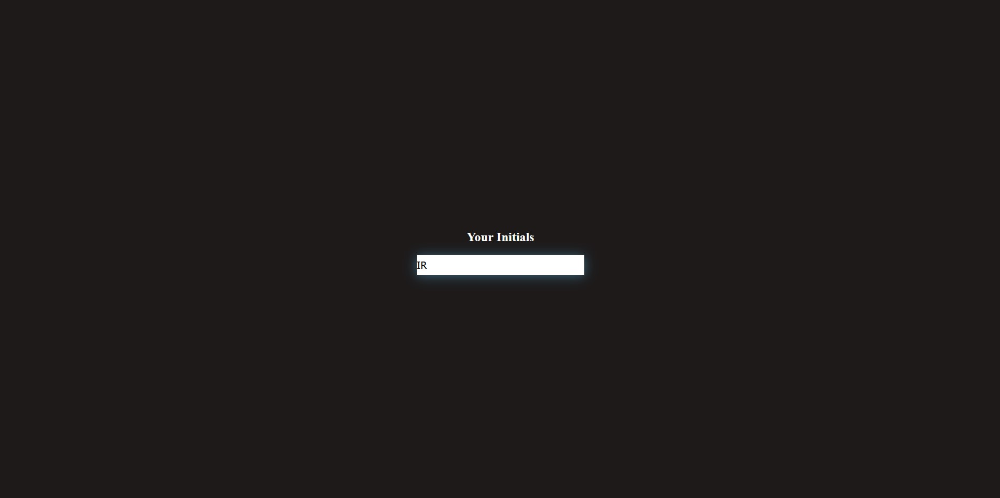
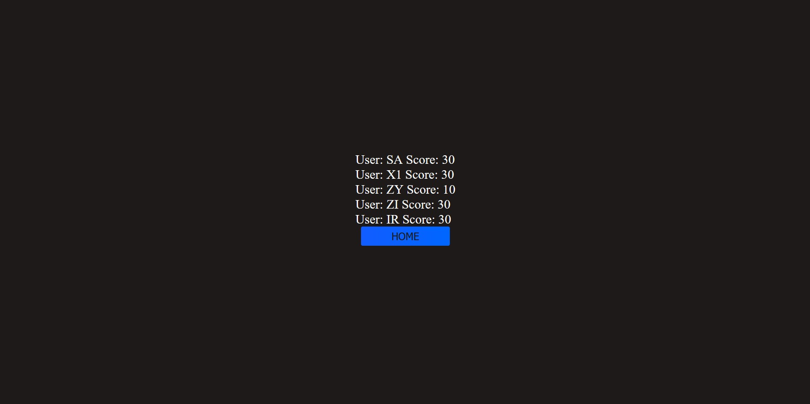

# pokemon-certficication-quiz

This project lets you test your pokemon knowledge through a 10 question quiz!

[Test your pokemon knowledge by clicking here!]()

## Features

- Timed interactive quiz
- Save your scores
- Highscores page

## Usage

The test can be started by clicking the "START" button on the home screen. The page will then render questions 1 at a time after you have clicked your desired answer. After all questions have been answered, the page will render a score submission form and ask for your initials. You can view your past scores by clicking the "HIGHSCORES" button on the home page.

## Page Appearance

Here are some screenshots of the page:

## Built With

- HTML
- CSS
- JavaScript

## License

This project is licensed under the MIT License.